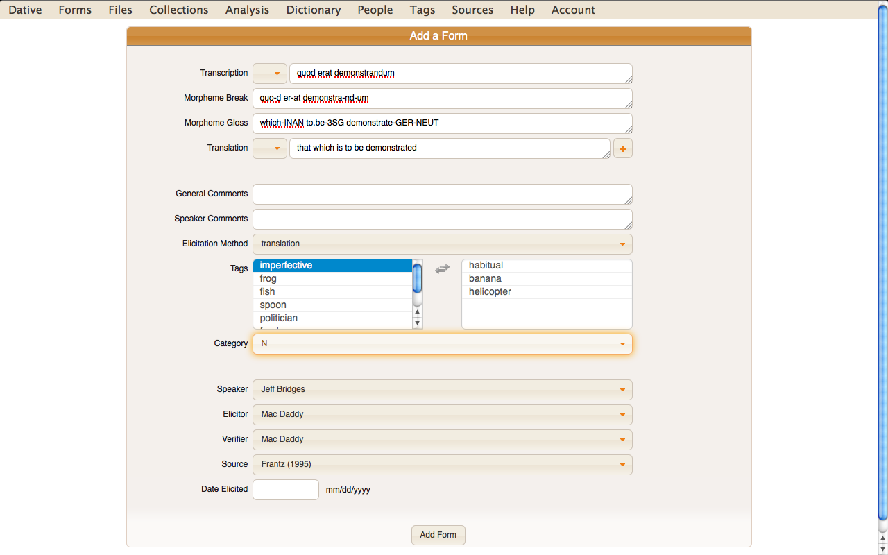

# Dative

## Description

Dative is a graphical interface for linguistic fieldwork and language
documentation applications. At present, Dative works with the [Online
Linguistic Database (OLD)](http://www.onlinelinguisticdatabase.org).

## Features

- Collaboration and data sharing
- Advanced and smart search
- Automatic morpheme cross-referencing
- Build morphological parsers and phonologies
- CSV import
- Text creation
- Media file (i.e., audio, video, image)-to-text association.
- User access control
- Documentation
- Open source

## For Developers

Dative is open source and under active development.

### Technologies

- Backbone
- CoffeeScript
- Mocha/Chai tests
- Grunt task automation

### Install

First, make sure you have NodeJS >= 0.10 installed. Then install the Grunt
command line interface (CLI):

    $ sudo npm install -g grunt-cli

Then clone the dative repo and move into the clone:

    $ git clone https://github.com/jrwdunham/dative.git
    $ cd dative

Then install the Node dependencies:

    $ npm install

Then install the Bower dependencies for the app and the tests:

    $ bower install
    $ cd test
    $ bower install
    $ cd ..

### Serve, test, build, etc.

To serve the app with livereload, run:

    $ grunt serve

The serve task generates source map files that Chrome's developer tools can
recognize. This means that you can view the CoffeeScript source in the browser
and can set breakpoints, etc. For some docs on CoffeeScript source maps and
JavaScript debugging in Chrome, see:

- http://www.html5rocks.com/en/tutorials/developertools/sourcemaps/
- https://developer.chrome.com/devtools/docs/javascript-debugging

To run the tests and view the Mocha print-out in the browser, run:

    $ grunt serve:test

After running the above command, the browser will automatically refresh
whenever a source file or a test file is saved. This allows you to code with
constant updates showing which tests are passing.

To build the app in the dist/ directory:

    $ grunt build

To build the app in the dist/ directory and serve the result:

    $ grunt serve:dist

To validate the CoffeeScript using coffeelint:

    $ grunt lint

To run the tests and view the results in the command line (*currently
not working*):

    $ grunt test

To generate the docco HTML docs using the comments in your source files:

    $ grunt docs

The above command generates files in the docs/ directory. Because docco
overwrites files of the same name in different directories, I have configured
the Gruntfile to rename each file for doc generation using the file's path.

